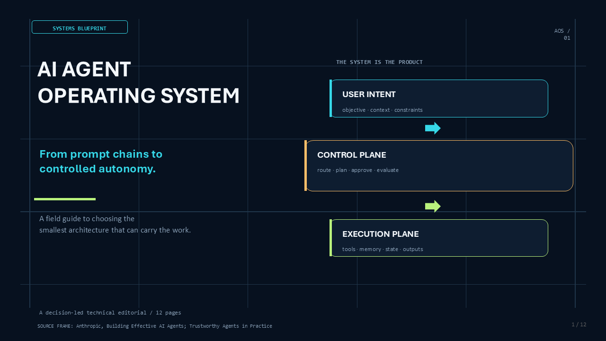
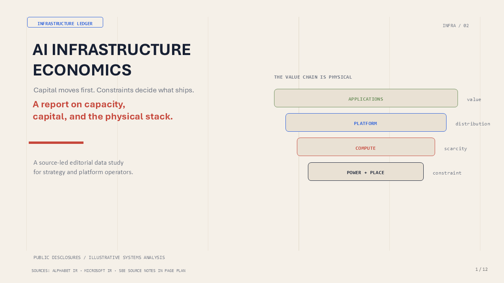
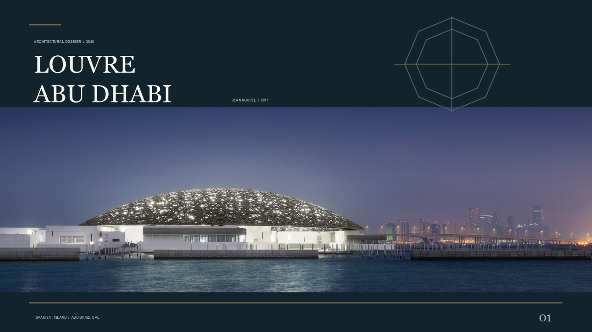
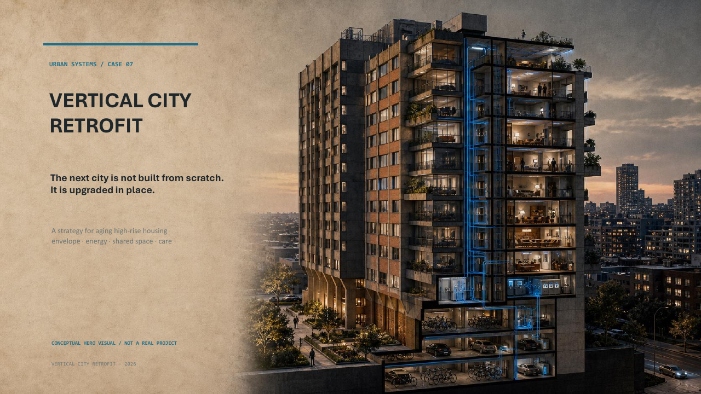

<div align="center">

<p align="center"></p>

<h1 align="center">PPT Design Skill</h1>

<p align="center"><strong>原生可编辑 · 视觉设计驱动</strong></p>

一个以设计决策和交付质量为核心的 PowerPoint skill。PPTX 的实际生成由已发布的
[`pptx-designer`](https://pypi.org/project/pptx-designer/) Python 标准库
负责；本 Skill 负责需求确认、结构设计、视觉方案、生成编排、PNG 视觉验收
以及返工交付。

<p align="center">
  
  
  
</p>

[English README](docs/README_EN.md) · [中文使用手册](docs/usage-guide.md) ·
[真实案例](examples/README.md) · [安装说明](installer/README.md)

</div>

---

## 先选对生成模式

### 交付级任务，默认选择 **Build Mode**

如果你的 PPT 要交给客户、管理层、投资人或正式会议使用，优先使用
**Build Mode**。它允许 LLM 逐页规划结构、锁定视觉方向、精确控制布局，
并在 PPTX → PDF → PNG 后进行视觉复核和返工，是三种模式中视觉控制力和
交付确定性最高的路径。

| 模式 | 最适合 | 布局控制 | 速度 | 推荐度 |
|---|---|---:|---:|---:|
| **Build Mode** ⭐ | 客户交付、提案、战略、路演、 editorial、正式汇报 | 最高：逐页、逐元素控制 | 中等 | **首选** |
| **FreeStyle Mode** | 快速探索、方向草稿、内容已经明确的轻量 PPT | 中等：由 `generate_ppt()` 自动编排 | 最快 | 探索优先 |
| **VI Build Mode** | 已有企业模板、母版或品牌规范的 PPT | 受模板约束：提取并保持品牌 DNA | 中等 | 模板优先 |

### 如何判断

- 你关心“最终看起来是否专业”，而不是只要一个草稿：**Build Mode**；
- 你想快速验证主题、内容或风格方向：**FreeStyle Mode**；
- 你必须沿用企业模板、Logo、字体和版式：**VI Build Mode**。

FreeStyle 的 `generate_ppt(query=...)` 和
`generate_ppt(content=...)` 是同一个模式的两种输入方式，不是两条独立
的生成引擎。无论选择哪种模式，正式交付都必须经过 PNG 视觉检查。

<div align="center">
  <strong>推荐决策：</strong> 不确定时使用 Build Mode；只有在明确追求速度或
  必须服从现有模板时，才选择 FreeStyle 或 VI Build Mode。
</div>

## Skill 的核心价值：保证设计决策与交付质量

`pptx-designer` 负责把设计决策生成成可编辑 PPTX；本 Skill 负责保证设计
决策和交付过程的质量：

```text
需求确认
  → 领域判断与页面结构
  → 视觉方向建议与用户确认
  → 设计 token / 页面锚点锁定
  → pptx-designer 生成可编辑 PPTX
  → PPTX → PDF → PNG
  → 第一门：整体视觉效果与客户级完成度
  → 第二门：严重缺陷、需求和可编辑性检查
  → 源码/内容返工并重新渲染
  → 用户确认与交付
```

技术上“运行成功”不等于设计完成。Skill 会直接检查导出的 PNG，判断页面
是否有视觉重心、合理密度、清晰层级、完整构图，以及是否真正符合用户需求。
只有通过两道门并完成必要返工，才进入用户确认与交付：第一门检查整体视觉
效果与客户级完成度；第二门检查严重缺陷、需求覆盖和可编辑性。

生成前，LLM 会把用户需求整理成可追踪的视觉验收合同；生成 PNG 后，逐项
对照需求和页面证据，记录 `PASS`、`NEEDS_REVISION` 或 `BLOCKED`。因此 PNG
检查不是泛泛地判断“好不好看”，而是验证结果是否真正满足用户目标。

## 精选设计案例

这里展示的是可以下载、打开并继续编辑的完整 PowerPoint 案例。它们覆盖
技术系统、基础设施研究、科学证据、文化建筑和城市策略，用来说明本技能
如何把内容结构、视觉方向和原生可编辑对象结合成完整的演示设计。

| 案例 | 设计定位 | 视觉语言与设计重点 |
|---|---|---|
| [AI Agent Operating System](https://sunchaokun.github.io/PPT-Design-Skill/viewer.html?project=ai-agent-operating-system) | 技术系统蓝图 | 深色网格、分层架构、荧光色标记、流程与治理 |
| [AI Infrastructure Economics](https://sunchaokun.github.io/PPT-Design-Skill/viewer.html?project=ai-infrastructure-economics) | 编辑型产业研究 | 纸张质感、物理约束隐喻、数据层级、战略叙事 |
| [Single-Cell CAR T Atlas](https://sunchaokun.github.io/PPT-Design-Skill/viewer.html?project=car-t-single-cell-atlas) | 论文型科学叙事 | 图证结构、研究设计、证据边界与可编辑机制图 |
| [Louvre Abu Dhabi](https://sunchaokun.github.io/PPT-Design-Skill/viewer.html?project=louvre-abudhabi) | 建筑文化叙事 | 真实摄影、可编辑几何、气候逻辑与博物馆城市空间 |
| [Vertical City Retrofit](https://sunchaokun.github.io/PPT-Design-Skill/viewer.html?project=vertical-city-retrofit) | 城市更新策略 | 建筑剖面、系统图、情景数据、治理与决策框架 |
| [COUTURE COLOR — Objects of Desire](https://sunchaokun.github.io/PPT-Design-Skill/viewer.html?project=couture-color-objects-of-desire) | 高定美妆编辑叙事 | 全屏妆效肖像、同一模特的上妆动作、可编辑产品结构与材质叙事 |

这些案例不是为了证明代码能够运行，而是为了展示从设计判断到最终页面
完成度的完整结果。更多页面和下载入口请查看[在线案例画廊](https://sunchaokun.github.io/PPT-Design-Skill/)
和 [examples/README.md](examples/README.md)。

点击任意预览即可进入在线查看器，浏览完整页面并下载 PPTX、PDF：

<table>
<tr>
<td width="33.33%"><a href="https://sunchaokun.github.io/PPT-Design-Skill/viewer.html?project=ai-agent-operating-system"></a></td>
<td width="33.33%"><a href="https://sunchaokun.github.io/PPT-Design-Skill/viewer.html?project=ai-infrastructure-economics"></a></td>
<td width="33.33%"><a href="https://sunchaokun.github.io/PPT-Design-Skill/viewer.html?project=car-t-single-cell-atlas"></a></td>
</tr>
<tr>
<td width="33.33%"><a href="https://sunchaokun.github.io/PPT-Design-Skill/viewer.html?project=louvre-abudhabi"></a></td>
<td width="33.33%"><a href="https://sunchaokun.github.io/PPT-Design-Skill/viewer.html?project=vertical-city-retrofit"></a></td>
<td width="33.33%"><a href="https://sunchaokun.github.io/PPT-Design-Skill/viewer.html?project=couture-color-objects-of-desire"></a></td>
</tr>
</table>

## Install

Clone the repository first, then run the installer from the repository root.
The installer automatically installs the published `pptx-designer` Python
package and copies the skill bundle to the selected coding assistant:

```powershell
# Clone the skill repository
git clone https://github.com/sunchaokun/PPT-Design-Skill.git
cd PPT-Design-Skill

python installer/install.py --platform opencode --force
python skill/scripts/check_runtime.py
```

请使用 `installer/install.py` 完成 Skill 安装。仓库根目录的 `install.py`
仅用于安装 Python 运行包 `pptx-designer`，不会把 Skill 注册到编码工具中。

Replace `opencode` with `claude`, `codex`, `deepseek-harness`, or `all` as
needed. Restart the coding assistant after installation.

### LibreOffice 为什么是可选依赖？

PPTX 的生成本身只依赖 Python 包 `pptx-designer`，不要求安装 LibreOffice。
但按照 Skill 的质量流程，生成 PPTX 后还需要将它渲染为 PDF 和 PNG，检查
文字溢出、图片裁切、构图和页间节奏：

- 有 Microsoft PowerPoint 时，Windows 优先使用 PowerPoint COM 渲染；
- 没有 PowerPoint 时，使用 LibreOffice 的 `soffice` 将 PPTX 转为 PDF；
- 再使用 Poppler 的 `pdftoppm` 将 PDF 转为 PNG。

因此，LibreOffice 是无 PowerPoint 环境下的渲染后备方案，不是 PPTX 生成器，
也不是所有用户都必须安装的依赖。运行下面的命令可以检查当前环境：

```powershell
python skill/scripts/check_runtime.py
```

安装器会检查 PATH、Windows 默认安装目录和注册表中的 LibreOffice，不会因为
`soffice.exe` 没有加入 PATH 就误报未安装。桌面软件不会被静默安装；如果需要
使用 winget 显式安装 LibreOffice 和 Poppler，可以执行：

On Windows, users who explicitly want the installer to use `winget` may run:

```powershell
python installer/install.py --platform opencode --force --render-deps
```

## 检查真实案例

```powershell
python skill/scripts/inspect_pptx.py examples/new_examplex/louvre_abudhabi/output/louvre_abudhabi_complete.pptx --pretty
powershell -ExecutionPolicy Bypass -File skill/scripts/render_pptx.ps1 `
  -InFile examples/new_examplex/louvre_abudhabi/output/louvre_abudhabi_complete.pptx `
  -OutDir output/louvre-abudhabi-rendered
```

对其他维护案例重复执行。导出后，LLM 必须直接查看 PNG，
检查构图、层级、文字可读性、图片裁切、页间节奏、用户需求匹配度和可编辑
性。发现问题必须修改源代码或内容并重新渲染。

## 文档入口

- [Skill 主流程](skill/SKILL.md)
- [设计原则](skill/references/design-principles.md)
- [公共 API](skill/references/public-api.md)
- [质量与交付](skill/references/qa-and-delivery.md)
- [跨平台安装](installer/README.md)
- [真实评估样例](evals/001-chinese-enterprise-strategy/brief.md)
- [高定视觉方向评估](evals/002-couture-editorial/brief.md)
- [科研结果汇报评估](evals/003-scientific-research/brief.md)

## 解决什么问题

仅检查代码、文件和基础结构，不能保证 PPT 达到设计要求。即使“运行成功”，
仍可能存在标题层级弱、页面拥挤、图片裁切错误、图表不可读、页面重复和风格
不统一等问题。

本 skill 将视觉结果作为交付对象的一部分：

1. 用户先确认需求和受众；
2. LLM 先设计页面结构和视觉方向；
3. `pptx-designer` 把已确认的设计决策生成成可编辑 PPTX；
4. 通过确认过的 PPTX -> PDF -> PNG 路径导出页面；
5. LLM 直接查看 PNG，逐页判断是否达到设计要求；
6. 发现问题后回到 Python 源码或内容进行修订；
7. 重新导出并检查，最终交给用户确认。

## 设计能力

本 skill 采用成熟的 Designer Mindset，而不是把设计退化成选择一个
`style` 参数：

| 能力 | 作用 |
|---|---|
| Audience-first | 根据受众、场景和行动目标决定页面表达方式 |
| Narrative planning | 先设计页面级叙事，再生成代码 |
| Domain paradigms | 科研、论文、技术、医疗、政府和商业使用不同范式 |
| Design system | 锁定颜色、字体、间距、网格、图片和组件语言 |
| Density control | 控制页面信息量，避免用小字号塞满页面 |
| Structural variation | 页面结构随沟通目标变化，而不是重复同一种卡片 |
| Native editability | 文本、形状、图表和支持的 SVG 保持可编辑 |
| PNG visual review | 直接检查真实导出图像，而不是只检查源码 |

## 模式详细说明

| 模式 | 适用场景 | 核心实现 |
|---|---|---|
| Build Mode | 交付级空白画布精确设计 | Python + `pptx_designer.tools.*` |
| FreeStyle Mode | 快速探索或目标驱动生成 | `generate_ppt(query=...)` / `generate_ppt(content=...)` |
| VI Build Mode | 企业模板和品牌合规 | `extract_design_context()` + 原子 Build + `VIBuildDelivery` |

### FreeStyle

FreeStyle 使用 `pptx-designer.generate_ppt()` 完成库内的目标驱动生成：

```python
from pptx_designer import generate_ppt
from pptx_designer.renderer.theme import ThemeComposer

theme = ThemeComposer().compose(style="dark-tech", seed=17)
result = generate_ppt(
    "AI startup investor pitch",
    theme=theme,
    output="output/pitch.pptx",
)
```

当页面目标和文案已经明确时，使用结构化 `content`：

```python
result = generate_ppt(
    content={
        "title": "Q4 Revenue Review",
        "pages": [
            {"goal": "hook", "title": "Q4 2026", "subtitle": "Record quarter"},
            {"goal": "problem", "title": "The pressure is visible", "bullets": [
                "Enterprise demand is growing",
                "Delivery capacity is the constraint",
            ]},
            {"goal": "data", "title": "Key metrics", "bullets": [
                "Revenue: $12.8M",
                "Retention: 89%",
            ]},
        ],
    },
    theme=theme,
    output="output/review.pptx",
)
```

`query` 和 `content` 都属于 FreeStyle，不是两个不同的渲染引擎。`content`
只是让 LLM 更明确地控制页面目标和文案；需要精确坐标时应使用 Build Mode。
`theme` 必须是 `ThemeComposer.compose()` 返回的完整 resolved theme；传入后不要
再同时传入 `style`、`palette`、`fonts`、`decoration`、`layout`、`mood` 或
`style_seed`。

### VI Build Mode

当用户提供 `template.pptx`、企业母版或明确要求品牌合规时使用 VI Build：

1. 使用 `extract_design_context()` 提取确定性的视觉证据；
2. 人工确认框架页、可写文本槽位、固定视觉层和视觉 grammar；
3. 用 `content_model`、原子组件、精确几何和 `relation_bindings` 设计内容页；
4. 用 `VITemplateAdapter.compile_atomic()` 编译内容页，并用 `VIBuildDelivery` 交付；
5. 通过 PPTX -> PDF -> PNG 检查原有页面和新增页面的一致性。

将品牌、主题或页面上下文叠加到模板证据时，使用
`merge_vi_design_context()`，不要使用通用的 `merge_design_context()`。

VI Build 不能承诺对所有 PowerPoint master、SmartArt、动画和 OOXML 行为
进行像素级复刻，详细边界见 [template-brand.md](skill/references/template-brand.md)。

### Build Mode

Build Mode 是交付级路径。LLM 生成普通 Python 文件，布局、文案、颜色和
数据都可以在 Git 中审查、修改和重复构建：

```python
from pptx_designer import Presentation
from pptx_designer.renderer.theme import ThemeComposer
from pptx_designer.tools.cards import kpi_card
from pptx_designer.tools.layout import page_header
from pptx_designer.tools.shapes import rect

theme = ThemeComposer().compose(style="professional", seed=17)
prs = Presentation(theme=theme, strict_theme=True)
slide = prs.slides.add_slide(prs.slide_layouts[6])
page_header(slide, "Q4 Revenue Report", "Financial Summary")
kpi_card(slide, 1.0, 2.0, 3.5, 1.5, "$12.8M", "Revenue", "+23%")
rect(slide, 0.5, 6.8, 12.3, 0.08, fill="primary")
prs.save("output/report.pptx")
```

Build Mode 规则：

- 所有坐标使用英寸；
- 使用 `pptx_designer` 公共 API；
- 优先使用原生文本、形状、图表和图示；
- 使用 `cover_image()` 保持图片比例；
- 颜色集中在设计 token 或 `C` 字典中；
- 不使用旧版 `ppt_pro_max` 或私有模块；
- 生成后必须运行、重开、导出和视觉检查。

## 设计过程中的三个控制量

| 控制量 | 低值 | 中值 | 高值 |
|---|---|---|---|
| Variance | 统一网格和组件 | 两到三种页面策略 | 章节页和多种结构 |
| Motion | 静态或淡入 | 章节转换和重点强调 | 仅在演讲场景适合时使用更强动效 |
| Density | 大留白、少元素 | 叙事和数据混合 | 仪表盘、表格和高密度信息 |

这些控制量影响页面结构和信息节奏，不是简单的颜色开关。科研、学术和
医疗场景通常需要降低装饰和动效，即使主题本身是科技方向。

## 重要禁止行为

- 没有需求和页面结构就直接生成完整交付 PPT；
- 只换颜色、字体就把多个方案称为结构不同；
- 每页重复同一种卡片或项目符号布局；
- 用小字号容纳未经编辑的过量内容；
- 编造精确指标、客户案例、引用或证据；
- 拉伸图片或使用与内容无关的图片；
- 把整页内容烘焙为截图，替代可编辑对象；
- 将商业融资模板套用到科研、论文、医疗内容；
- 只确认 Python 和 PPTX 文件成功，不查看 PNG；
- PNG 发现问题后不重新生成、不重新检查。

## 运行和渲染

如需重新安装或升级 Python 运行时，可以直接运行安装器；它会自动处理
`pptx-designer`：

```powershell
python installer/install.py --platform all --force
python skill/scripts/check_runtime.py
```

安装 skill 到编码工具：

```powershell
python installer/install.py --platform claude --force
python installer/install.py --platform codex --force
python installer/install.py --platform opencode --force
python installer/install.py --platform deepseek-harness --force
```

导出 PPTX、PDF 和 PNG：

```powershell
powershell -ExecutionPolicy Bypass -File skill/scripts/render_pptx.ps1 `
  -InFile examples/new_examplex/louvre_abudhabi/output/louvre_abudhabi_complete.pptx `
  -OutDir output/louvre-abudhabi-rendered
```

渲染器优先使用 Microsoft PowerPoint COM；无 PowerPoint 时使用 LibreOffice
生成 PDF，再使用 Poppler 的 `pdftoppm` 生成 PNG。桌面渲染器属于系统依赖，
可以显式执行：

```powershell
python installer/install.py --render-deps
```

## 交付清单

正式交付通常包含：

- `.pptx` 文件；
- 可重复构建的 Python 源码或结构化 content；
- `.pdf` 预览文件；
- 每页 PNG 或联系表；
- 基础结构检查结果；
- PNG 视觉检查结果；
- 用户最终确认记录。

## 目录结构

```text
PPT-Design-Skill/
├── skill/
│   ├── SKILL.md
│   ├── agents/openai.yaml
│   ├── references/
│   └── scripts/
├── docs/
│   ├── README_EN.md
│   └── usage-guide.md
├── examples/new_examplex/
│   └── six maintained case-study packages
├── installer/
├── docs/
├── install.py
└── skill.json
```
